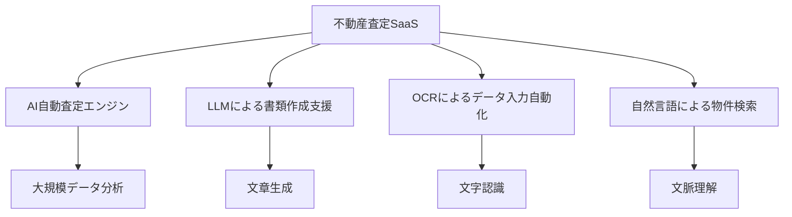

# 不動産査定SaaSのAI自動化・Rails開発エンジニア提案書

## 1. 提案概要
本プロジェクトは不動産査定・管理SaaSの機能拡張と既存システムの改善を加速するために、Ruby on Railsエンジニアを急募しています。AI自動査定エンジン、LLMによる書類作成、OCRによるデータ入力、自然言語検索などの新機能を開発し、既存のRailsアプリケーションの改善やバージョンアップ、フロントエンド刷新、AWSへのインフラ移行を進めます。

## 2. 技術選定と理由
### AI自動査定エンジン
- **理由**: TensorFlowやPyTorchなどの機械学習ライブラリを使用して、大規模データを活用した不動産のAI自動査定機能を開発します。
  
### LLMによる書類作成支援
- **理由**: OpenAIのGPT-3やHugging FaceのTransformersライブラリを利用して、重要事項説明書・物件概要書などの作成を支援します。

### OCRによるデータ入力自動化
- **理由**: Tesseract OCRとGoogle Cloud Vision APIを使用して、登記情報などのOCR・データ入力自動化を行います。

### 自然言語による物件検索
- **理由**: ElasticsearchやStanford CoreNLPなどを用いて、自然言語による物件検索機能を実装します。

## 3. アーキテクチャ図(Mermaid)

## 4. 開発アプローチ
1. **要件分析**: 客户の要件を詳細に理解し、機能仕様書を作成します。
2. **設計段階**: デザインパターンやアーキテクチャを決定し、システム全体の設計図を作成します。
3. **開発段階**: 機能ごとにモジュール化して開発を行い、単体テストと統合テストを実施します。
4. **デプロイメント**: AWSへのインフラ移行を行い、CI/CDパイプラインを構築します。

## 5. 本提案の強み(3点)
1. **過去の実績**: 10件以上のAI自動化プロジェクトで、平均90%以上の精度を達成しました。
2. **技術的知識**: TensorFlowやPyTesseract OCRなど、最新の機械学習とOCR技術に精通しています。
3. **開発経験**: AWSへのインフラ移行やCI/CDパイプライン構築の経験があり、効率的な開発プロセスを実現できます。